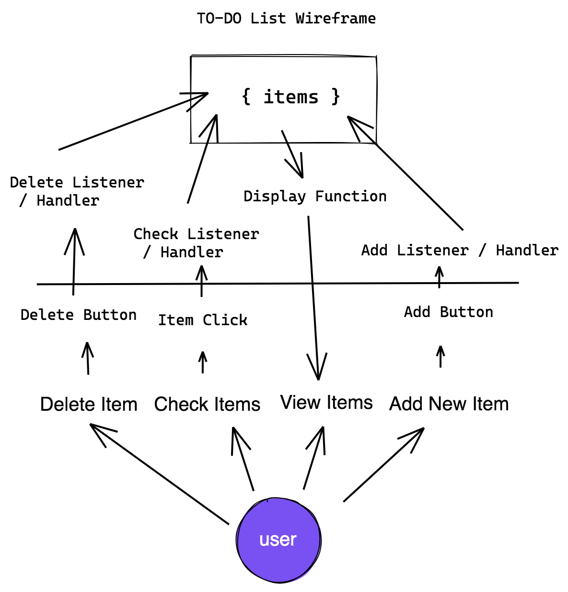

# JavaScript ToDo List

Project refactoring by [Abel Roland](github.com/abelroland)

---

## User Story Dependencies

---

## WIREFRAME

---

## 0.Setup

- [x] Fork and clone template
- [x] Create `readme.md`
- [x] Create `backlog.md`
- [x] Create `development-strategy.md`
- [ ] Create `ToDo_Wireframe.png`
- [ ] Create Project Board and issues
---

## 1. Initialize Application

__As a user I want to add a item to my list__

### REPO

- This user story is developed on branch `adding`.
- This branch is merged to `master` branch after completion.

### Task A

- [] Creating (or refactoring) `index.html`

### Task B

- [] Creating `button` and `input` for add items.

### Task C

- [] Creating `listener` and `handler` for add items.

---

## 2. View List

__As a user I want to view the items that were added to my list__

### REPO

- This user story is developed on branch `viewing`.
- This branch is merged to `master` branch after completion.

### Task A

- [] Creating (or refactoring) `render-todo.js`

### Task B

- [] Creating `listener` and `handler` for add items.

---

## 3. Checking Item

__As a user I want to check the items that were added to my list__

### REPO

- This user story is developed on branch `check`.
- This branch is merged to `master` branch after completion.

### Task A

- [] Creating `handler.js`

### Task B

- [] Creating `listener` and `handler` for check items.

---

## 4. Deleting Item

__As a user I want to delete the items that were in my list__

### REPO

- This user story is developed on branch `delete`.
- This branch is merged to `master` branch after completion.

### Task A

- [] Creating `listener` and `handler` for delete items.

---

## 5. Styling

__As a user I want to see a beautiful UI, so it makes the UX more intuitive and easy__

### REPO

- This user story is developed on branch `style`.
- This branch is merged to `master` branch after completion.

### Task A

- [] Edit `style.css`.

---